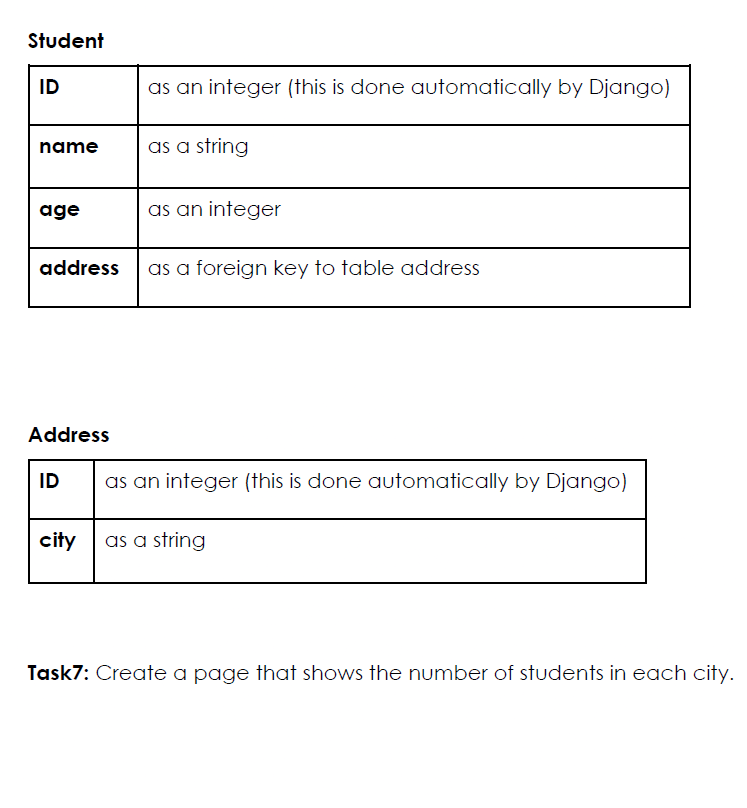

# Library Project - Lab 6 & Lab 7 Completion

This repository contains the completed tasks for Lab 6 (Django Forms) and Lab 7 (Django Models Part 1).

## Tasks Completed:

### Lab 6: Django Forms
- **Build HTML form template**: Created search.html using the master template base.html, including Font Awesome and custom CSS.
- **View function and URL**: Added search view in views.py and registered /books/search/.
- **Form Handling**: Implemented logic to handle POST data, filtering a static book list based on keywords and checkboxes.
- **Results Display**: Created bookList.html to list filtered books.

## lap7

### Lab 7: Django Models (Part 1)
- **Database Schema**: Defined the Book model in models.py with title, author, price, and edition.
- **Migrations**: Ran makemigrations and migrate to create the database table.
- **Data Entry**: Inserted the specified initial books.
- **Simple Query**: Added simple_query view to filter books containing 'and' in the title.
- **Lookup Query**: Added lookup_query view using the lab lookup conditions.
- **Result Links**:
    - **Simple Query**: http://127.0.0.1:8000/books/simple/query
    - **Lookup Query**: http://127.0.0.1:8000/books/lookup/query
    - **Lab Route**: http://127.0.0.1:8000/books/complex/query

## Lab 8: Django Models (Part 2) - Querying & Aggregation
Completed the following tasks for Lab 8:

### Tasks and Links:
- **Task 1 (Price <= 80):** [http://127.0.0.1:8000/books/lab8/task1](http://127.0.0.1:8000/books/lab8/task1)
- **Task 2 (Edition > 3 AND Title/Author has 'qu'):** [http://127.0.0.1:8000/books/lab8/task2](http://127.0.0.1:8000/books/lab8/task2)
- **Task 3 (NOT Task 2 conditions):** [http://127.0.0.1:8000/books/lab8/task3](http://127.0.0.1:8000/books/lab8/task3)
- **Task 4 (Books ordered by Title):** [http://127.0.0.1:8000/books/lab8/task4](http://127.0.0.1:8000/books/lab8/task4)
- **Task 5 (Aggregation - Count, Sum, Avg, Max, Min):** [http://127.0.0.1:8000/books/lab8/task5](http://127.0.0.1:8000/books/lab8/task5)
- **Task 6 (Database Schema):** Created Student and Address models with One-to-Many relationship.
- **Task 7 (Student count per city):** [http://127.0.0.1:8000/books/lab8/task7](http://127.0.0.1:8000/books/lab8/task7)

## Running the Server:
To view the application, run:
```bash
python manage.py runserver
```
Then navigate to the links above.
